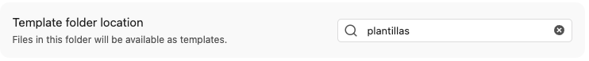
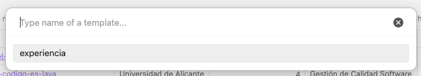
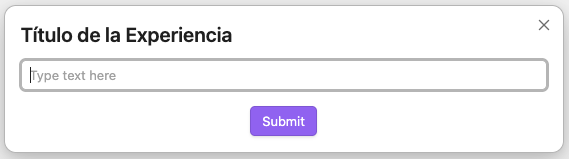
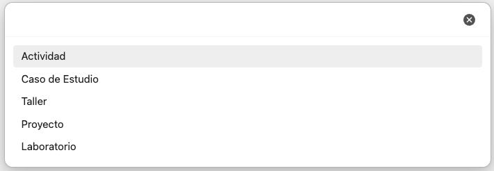
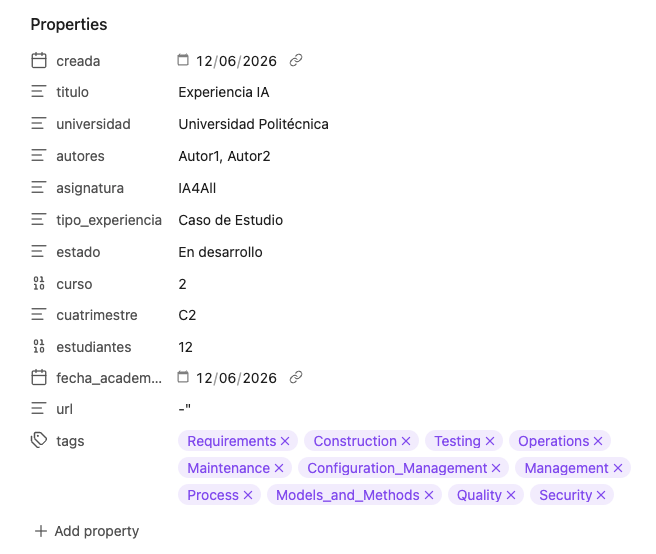

# Guía de Contribución

¡Gracias por querer compartir tu experiencia! Este documento explica cómo contribuir una experiencia docente, qué convenciones seguir y cómo funciona el proceso de revisión.

---

## Índice

- [Guía de Contribución](CONTRIBUTING.md#Guía%20de%20Contribución)
  - [Antes de empezar](CONTRIBUTING.md#Antes%20de%20empezar)
  - [Cómo aportar una experiencia](CONTRIBUTING.md#Cómo%20aportar%20una%20experiencia)
    - [Opción A: Pull Request (recomendada)](CONTRIBUTING.md#Opción%20A%20Pull%20Request%20(recomendada))
    - [Opción B: Issue (para quienes no usen Git habitualmente)](CONTRIBUTING.md#Opción%20B%20Issue%20(para%20quienes%20no%20usen%20Git%20habitualmente))
  - [Crear una nueva experiencia](CONTRIBUTING.md#Crear%20una%20nueva%20experiencia)
	  - [Opción A: Obsidian (recomendada)](CONTRIBUTING.md#Opción%20A%20Obsidian%20(recomendada))
	  - [Opción B: editor texto](CONTRIBUTING.md#Opción%20B%20editor%20texto)
  - [Estructura de una experiencia](CONTRIBUTING.md#Estructura%20de%20una%20experiencia)
    - [Frontmatter YAML](CONTRIBUTING.md#Frontmatter%20YAML)
    - [Secciones](CONTRIBUTING.md#Secciones)
  - [Convenciones](CONTRIBUTING.md#Convenciones)
    - [Nombres de fichero](CONTRIBUTING.md#Nombres%20de%20fichero)
    - [Disciplinas SWEBOK](CONTRIBUTING.md#Disciplinas%20SWEBOK)
    - [Idioma](CONTRIBUTING.md#Idioma)
    - [Imágenes](CONTRIBUTING.md#Imágenes)
  - [Proceso de revisión](CONTRIBUTING.md#Proceso%20de%20revisión)
  - [Preguntas frecuentes](CONTRIBUTING.md#Preguntas%20frecuentes)

---

## Antes de empezar

- Lee el [README](README.md) para entender el propósito y la estructura del repositorio.
- Consulta las [experiencias existentes](experiencias/) para hacerte una idea del nivel
  de detalle esperado.
- Comprueba que tu experiencia no está ya documentada (búsqueda por universidad,
  herramienta o asignatura).

---

## Cómo aportar una experiencia

### Opción A: Pull Request (recomendada)

Es la vía preferida si tienes experiencia con Git. Permite revisión directa sobre
el contenido y trazabilidad de los cambios.

**Pasos:**

1. Haz **fork** del repositorio y clónalo localmente:
```bash
   git clone https://github.com/sistedes-ia4sw/ai-se-learn.git
   cd ai-se-learn
```

2. Crea una rama descriptiva:
```bash
   git checkout -b experiencia/tu-universidad-tema-breve
```
   Ejemplo: `experiencia/unizar-copilot-code-review`

3. [Crear una nueva experiencia](CONTRIBUTING.md#Crear%20una%20nueva%20experiencia)

4. Haz commit y push:
```bash
   git add experiencias/titulo-de-tu-experiencia.md
   git add assets/img/   # si hay imágenes
   git commit -m "Nueva experiencia: Título descriptivo de tu experiencia"
   git push origin experiencia/tu-universidad-tema-breve
```

5. Abre un **Pull Request** contra `main` desde GitHub. Completa el checklist
   de la plantilla de PR antes de solicitar revisión.

---

### Opción B: Issue (para quienes no usen Git habitualmente)

Si no estás familiarizado con Git o con el flujo de Pull Requests, puedes aportar tu experiencia abriendo un **Issue** con la etiqueta `nueva-experiencia`. Usa la plantilla de Issue proporcionada, que contiene los mismos campos que la plantilla Markdown. Un mantenedor se encargará de convertirlo en el fichero `.md` correspondiente y te dará crédito como autor/a.

> [Abrir un Issue de nueva experiencia](../../issues/new?template=nueva-experiencia.yml&labels=nueva-experiencia)

---

## Crear una nueva experiencia

### Opción A: Obsidian (recomendada)

**Requiere** el plugin de comunidad **Templater** y configurar `plantillas/` como carpeta de plantillas dentro de la configuración del plugin. Este plugin permite crear nuevas experiencias de forma guiada.


1. Crea una **nueva nota** en obsidian.

2. **Activa Templater** mediante el botón de la barra de herramientas lateral izquierda y selecciona la plantilla `experiencias`.


3. Al crear una nota a partir de una plantilla con `Templater`, se abrirá un **cuadro de diálogo** par introducir el título de la nota y el resto de campos de información del `frontmatter`. 

Si se intenta crear una nota cuyo título ya existe, se producirá un error.


4. Una vez creada la nota, **elimina** del campo `tags` todas las **disciplinas SWEBOK que no correspondan** a la experiencia.


5. **Rellena el resto de secciones** de la plantilla y borra aquellas que no vayas a usar, pero mantén la numeración de las secciones.

6. Si incluyes **imágenes**, colócalas en `assets/img/` con un prefijo identificativo:
```bash
   assets/img/copilot-code-review-flujo.png
```


#### Plugins de Obsidian recomendados

| Plugin              | Uso                                                     |
| ------------------- | ------------------------------------------------------- |
| **Templater**       | Creación guiada de nuevas experiencias con la plantilla |
| **Advanced Tables** | Edición sencilla de tablas en markdown                  |                                                                             |

---

### Opción B: editor texto

1. Copia la plantilla y renómbrala siguiendo las reglas para los [nombres de fichero](CONTRIBUTING.md#Nombres%20de%20fichero):
```bash
   cp plantillas/experiencia-texto.md experiencias/titulo-de-tu-experiencia.md
```

2. Rellena el fichero: primero el frontmatter YAML y luego cada sección. Los campos marcados con `*` son **obligatorios**. Revisa la [estructura de una experiencia](CONTRIBUTING.md#Estructura%20de%20una%20experiencia) para tener claro el significado de cada parte.

3. Si incluyes imágenes, colócalas en `assets/img/` con un prefijo identificativo:
```bash
   assets/img/copilot-code-review-flujo.png
```

---

## Estructura de una experiencia

Cada fichero sigue esta estructura:

### Frontmatter YAML

```yaml
---
creada: "2026-06-12"                                     # * obligatorio
titulo: "Título descriptivo de la experiencia"           # * obligatorio
universidad: "Nombre de la universidad"                  # * obligatorio
autores: "Profesor(es) / Autores (separados por coma)"   # * obligatorio
asignatura: "Nombre de la asignatura"                    # * obligatorio
tipo_experiencia: ["Actividad", "Caso de Estudio", "Taller", "Proyecto", "Laboratorio"]                                           # * obligatorio
estado: ["Activa", "En desarrollo", "Archivada"]         # * obligatorio
curso: ["1", "2", "3", "4", "Master"]                    # * obligatorio
cuatrimestre: ["C1", "C2", "Anual"]                      # * obligatorio
estudiantes: "Número de estudiantes"
fecha_academica: "2025-12-15"
url: "URL de información adicional"
tags:                                                    # al menos una
  - Requirements
  - Architecture
  - Design
  - Construction
  - Testing
  - Operations
  - Maintenance
  - Configuration_Management
  - Management
  - Process
  - Models_and_Methods
  - Quality
  - Security
---
```

### Secciones

| Sección                             | Contenido esperado                                           | 
| ----------------------------------- | ------------------------------------------------------------ |
| **1. Información General**          | Contexto académico, número de estudiantes, modalidad         |
| **2. Objetivos de la Innovación**   | Conocimientos, habilidades y competencias perseguidas        |
| **3. Metodología y Diseño**         | Estrategia didáctica, herramientas, secuencia de actividades |
| **4. Implementación y Resultados**  | Ejecución, participación, evidencias y datos                 |
| **5. Análisis Crítico y Reflexión** | Evaluación, desafíos, ética, lecciones aprendidas            |
| **6. Guía de Replicabilidad**       | Orientaciones para reproducir la experiencia                 |
| **7. Futuras Mejoras**              | Propuestas de evolución y transferencia a otros contextos    |

Las secciones 1–3 son **obligatorias** para que una experiencia sea aceptada.
Las secciones 4–7 son muy recomendables y aumentan significativamente el valor de la contribución.

---

## Convenciones

### Nombres de fichero

Usa **kebab-case** basado en la herramienta principal y el contexto de uso:

```bash
chatgpt-generacion-casos-prueba.md
copilot-pair-programming-construccion.md
claude-revision-codigo-arquitectura.md
```

Evita incluir el nombre de la universidad en el fichero: esa información ya está en el frontmatter y los nombres de fichero deben ser descriptivos del contenido, no del origen.

### Disciplinas SWEBOK

Usa **exactamente** estos valores en el campo `tag`:

`Requirements` · `Architecture` · `Design` · `Construction` · `Testing` ·`Operations` · `Maintenance` · `Configuration Management` · `Management` ·`Process` · `Models and Methods` · `Quality` · `Security`

Cualquier valor fuera de esta lista será solicitado como corrección durante la revisión.

### Idioma

Las experiencias pueden redactarse en **español** o en **inglés**. Los nombres de los campos del frontmatter deben mantenerse en español tal como están definidos en la plantilla, para garantizar la compatibilidad con las consultas Dataview.

### Imágenes

- Formato preferido: PNG o SVG. Evita JPEGs para capturas de pantalla.
- Resolución mínima recomendada: 1200px de ancho.
- Prefijo obligatorio en el nombre: identifica tu experiencia.

```bash
assets/img/copilot-pair-programming-flujo.png
assets/img/copilot-pair-programming-resultados.png
```

- Referencia con ruta relativa desde el fichero de experiencia:
```markdown
  
```

---

## Proceso de revisión

1. Al abrir un PR, GitHub asigna automáticamente revisores del equipo
   `@sistedes-ia4sw/mantenedores` para los ficheros en `experiencias/`.
2. El reviewer comprueba: plantilla completa, campos obligatorios, convenciones
   de nombre y disciplinas SWEBOK, y que el contenido sea comprensible y
   replicable por un docente de otra universidad.
3. Los comentarios se hacen directamente sobre el diff del PR. El autor
   responde o aplica los cambios solicitados.
4. Con al menos **una aprobación** de un mantenedor de distinta universidad,
   el PR puede mergearse.
5. El merge se hace con **squash** para mantener el historial de `main` limpio.

El objetivo de la revisión es constructivo: mejorar la claridad y replicabilidad de la experiencia, no filtrar aportaciones. Cualquier experiencia bien documentada tiene cabida en el repositorio.

---

## Preguntas frecuentes

**¿Puedo documentar una experiencia que no salió como esperaba?**
Sí, y es especialmente valioso. Las secciones de análisis crítico y lecciones aprendidas son las más útiles para otros docentes.

**¿Puedo actualizar una experiencia ya publicada?**
Sí. Abre un PR con los cambios y explica en la descripción qué ha cambiado y por qué.

**¿Puedo documentar la misma herramienta que otra experiencia existente?**
Sí, siempre que el contexto sea diferente (asignatura, metodología, nivel educativo). La diversidad de contextos es precisamente el valor del repositorio.

**¿Es necesario tener datos cuantitativos en la sección de resultados?**
No es obligatorio, pero sí recomendable. Evidencias cualitativas (reflexiones, citas de estudiantes, observaciones del docente) también son válidas.

**¿Quién puede ser mantenedor?**
Cualquier docente que haya contribuido al menos una experiencia publicada y quiera implicarse en la revisión. Abre un Issue con la etiqueta `mantenedor` para solicitarlo.


