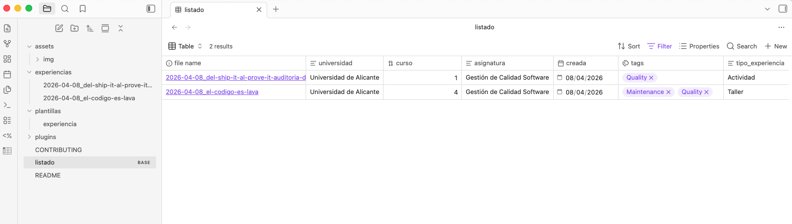
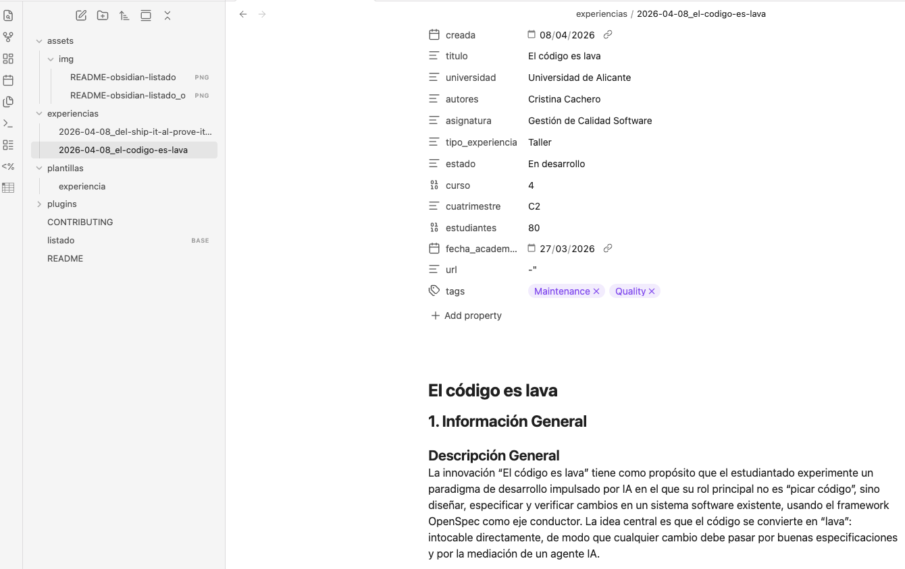

# Base de Conocimiento de Experiencias Docentes con IA en Ingeniería del Software

Repositorio colaborativo que recopila experiencias de uso de **Inteligencia Artificial Generativa** en la docencia de asignaturas de **Ingeniería del Software**. Está mantenido por docentes de múltiples universidades con el objetivo de compartir, documentar y facilitar la replicabilidad de innovaciones pedagógicas.

## ¿Qué contiene este repositorio?

Cada experiencia es un fichero Markdown (`.md`) que documenta de forma estructurada cómo un docente ha integrado herramientas de IA generativa en su asignatura. Las experiencias siguen una plantilla común con siete secciones:

1. **Información General** — Datos básicos: universidad, asignatura, curso, disciplinas SWEBOK implicadas.
2. **Objetivos de la Innovación** — Qué conocimientos, habilidades y competencias se persiguen.
3. **Metodología y Diseño** — Estrategia didáctica, herramientas, secuencia de actividades, roles.
4. **Implementación y Resultados** — Ejecución en el aula, participación, evidencias y datos.
5. **Análisis Crítico y Reflexión** — Evaluación, desafíos, ética y lecciones aprendidas.
6. **Guía de Replicabilidad** — Orientaciones prácticas para que otros docentes puedan reproducir la experiencia.
7. **Futuras Mejoras o Adaptaciones** — Propuestas de evolución y transferencia a otros contextos.

## Estructura del repositorio

```
.
├── README.md                   # Este fichero
├── CONTRIBUTING.md             # Guía detallada de contribución
├── LICENSE
├── plantillas/
│   └── experiencia.md          # Plantilla Templater para Obsidian
├── plantillas-texto/
│   └── experiencia-texto.md    # Plantilla en texto para Obsidian
├── experiencias/
│   ├── chatgpt-generacion-casos-prueba.md
│   ├── copilot-pair-programming-construccion.md
│   └── ...
└── assets/           # Imágenes y recursos referenciados desde las experiencias
    └── img/
```

## Cómo consultar la base de conocimiento

### En GitHub (navegador)

Navega a la carpeta [`experiencias/`](experiencias/) y abre cualquier fichero `.md`. GitHub renderiza el Markdown directamente, incluyendo el frontmatter YAML como tabla de metadatos. Puedes usar la búsqueda de GitHub (`/` o la barra de búsqueda) para localizar experiencias por universidad, herramienta, disciplina SWEBOK, etc.

### En Obsidian (local - recomendada)

1. Clona el repositorio:
   ```bash
   git clone https://github.com/TU-ORG/ai-se-learn.git
   ```
2. Abre la carpeta clonada como vault en [Obsidian](https://obsidian.md/download) (*Open folder as vault*).
3. Abre el fichero listado (BASE) que contiene un listado interactivo de todas las experiencias que permite aplicar filtros por cualquiera de los datos de la información general, como por ejemplo el nombre de una universidad.

4. Selecciona una experiencia para verla con detalle.


5. También puedes seleccionar una experiencia concreta desde la carpeta `experiencias/`

## Cómo contribuir

### Aportar una experiencia

Revisa nuestra [guía de contribución](CONTRIBUTING.md).

### Formar parte del equipo de mantenedores

Si eres:
- docente de una universidad española, 
- miembro de [SISTEDES](https://www.sistedes.es/), 
- has contribuido al menos una experiencia publicada 
- y quieres implicarte en la revisión. 

Abre un Issue con la etiqueta `mantenedor` para solicitarlo.

## Gobernanza y revisión

Este repositorio se gestiona con un modelo abierto de revisión por pares:

- **Mantenedores**: un grupo de docentes de distintas universidades con permisos de merge. Si quieres unirte como mantenedor, abre un Issue con la etiqueta `mantenedor`.
- **Revisión de PRs**: cada PR es revisado por al menos un mantenedor que no sea de la misma universidad que el autor, para garantizar que la experiencia es comprensible y replicable por terceros.
- **Criterios de aceptación**: la experiencia debe usar la plantilla oficial, tener los campos obligatorios completos, y aportar contenido sustancial en al menos las secciones 1–3.

## Código de conducta

Este es un espacio académico y profesional. Se espera que todas las interacciones (Issues, PRs, comentarios) mantengan un tono respetuoso y constructivo. Nos adherimos al [Contributor Covenant v2.1](https://www.contributor-covenant.org/es/version/2/1/code_of_conduct/).

## Licencia

El contenido de este repositorio se distribuye bajo licencia [Creative Commons Attribution-ShareAlike 4.0 International (CC BY-SA 4.0)](https://creativecommons.org/licenses/by-sa/4.0/deed.es). Puedes reutilizar y adaptar las experiencias siempre que cites la autoría original y mantengas la misma licencia.

## Contacto

Si tienes dudas sobre el proyecto o quieres proponer mejoras en la estructura de la base de conocimiento, abre un [Issue de discusión](../../issues/new?labels=discusión) o contacta con los mantenedores.